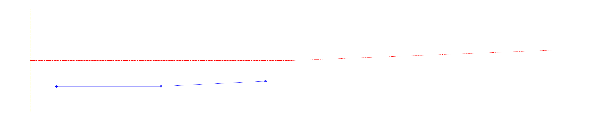

# dxf-civil

A Claude Code skill for working with civil-engineering DXF drawings.

Lets an AI agent inspect, render, validate, and modify CAD drawings without dumping their contents into the chat — built on [`ezdxf`](https://ezdxf.readthedocs.io/) with a progressive-disclosure workflow tuned for big files (10MB+) and real-world messy DXFs.



## What it does

Drop this into `~/.claude/skills/` and Claude Code gains seven CAD-aware commands plus a workflow that tells it when to use each:

| Script | Purpose |
| --- | --- |
| `summary.py` | JSON map of a drawing — version, units, extents, every layer, blocks, text samples, audit (always-first call) |
| `render.py`  | PNG render via matplotlib, with layer / bbox / layout filtering — for visual reasoning |
| `layer.py`   | Drill into a specific layer, get full entity attributes |
| `query.py`   | Regex search across TEXT / MTEXT / block attributes / dimension overrides |
| `spatial.py` | Find entities near a point (radius) or inside a bounding box |
| `validate.py`| Structural audit + standards compliance check against `standards/layers.yml` |
| `takeoff.py` | Quantity takeoff — lengths, areas, block counts by layer (preliminary, not billable) |

The `SKILL.md` encodes hard rules: never read DXFs with `cat`/`grep`/`view`, always summarize before drilling down, always render before reasoning about geometry, always write to `output/` not `input/`, use `ezdxf.recover` for malformed files.

## Install

```bash
# Clone into your Claude Code skills directory
git clone https://github.com/<your-username>/dxf-civil ~/.claude/skills/dxf-civil

# Install dependencies
pip install "ezdxf[draw]" matplotlib pyyaml
```

Per-project install: clone into `<your-project>/.claude/skills/dxf-civil` instead of `~/.claude/skills/`.

For `.dwg` files: convert to `.dxf` first via AutoCAD's `DXFOUT` command or the free [ODA File Converter](https://www.opendesign.com/guestfiles/oda_file_converter). `ezdxf` cannot read DWG directly.

## Try it

```bash
# Map a drawing
python scripts/summary.py path/to/drawing.dxf > summary.json

# See it
python scripts/render.py path/to/drawing.dxf --out preview.png

# Just the storm and sanitary layers, high-res
python scripts/render.py path/to/drawing.dxf \
  --layers "C-STORM-*,C-SAN-*" --dpi 300 --out utilities.png

# Find every manhole callout
python scripts/query.py path/to/drawing.dxf --pattern "MH-\d+"

# Spatial query
python scripts/spatial.py path/to/drawing.dxf --near 1234.5,6789.0 --radius 50

# Check against office standards
python scripts/validate.py path/to/drawing.dxf

# Preliminary takeoff
python scripts/takeoff.py path/to/drawing.dxf --layers "C-ROAD-*,C-CURB-*"
```

Once installed under `.claude/skills/`, you don't run these manually — Claude Code reads `SKILL.md` and calls them automatically when you ask things like:

- "Summarize what's in `input/site.dxf`"
- "How many storm manholes are on this drawing?"
- "Show me just the water utilities"
- "Are there layers in this drawing that violate our office standard?"
- "Do a preliminary takeoff of curb length"
- "This drawing won't open in AutoCAD — can you fix it?"

## Customize for your office

The two files under `standards/` are templates with placeholder conventions:

- **`standards/layers.yml`** — layer naming pattern (regex), required and forbidden layers, per-layer color/linetype expectations. Default is US NCS-style (`C-ROAD-CENT`, `C-STORM-PIPE`, etc.) — edit to match your firm.
- **`standards/blocks.yml`** — your standard block library with expected attributes.

Customizing these is where most of the skill's value lives. Out of the box, `validate.py` enforces a generic NCS pattern that will flag most non-US-civil drawings.

## How it works

The skill follows a **progressive disclosure** pattern, same idea as how Claude Code reads codebases — it never loads the whole file into context. Instead:

1. `summary.py` produces a 5–50 KB JSON map (works fine on 200 MB drawings).
2. The agent picks an area of interest from that map.
3. `layer.py` / `query.py` / `spatial.py` drill down into just that area.
4. `render.py` lets the agent *see* the geometry with its vision capability — coordinates are abstract, pictures are concrete.
5. Modifications go through focused write scripts, dry-run before applying, then `validate.py` confirms the output.

This makes 10MB+ files tractable that would otherwise blow the context window.

## What it doesn't do

- **No DWG support** without external conversion (use ODA File Converter or AutoCAD).
- **No Civil 3D parametric editing.** Corridors, surfaces, alignments, pipe networks appear as proxy entities and are read-only.
- **`render.py` is not a plotter.** Output is for the agent's spatial reasoning and quick previews, not deliverables.
- **Takeoffs are preliminary.** Always verify before billable use. Hatch areas in particular are approximated via bounding box.

## Repo layout

```
dxf-civil/
├── SKILL.md                  # Instructions Claude Code reads at session start
├── README.md
├── LICENSE
├── scripts/
│   ├── _lib.py               # Shared helpers (safe loading, JSON, geometry)
│   ├── summary.py
│   ├── render.py
│   ├── layer.py
│   ├── query.py
│   ├── spatial.py
│   ├── validate.py
│   └── takeoff.py
├── standards/
│   ├── layers.yml            # Office layer standard (CUSTOMIZE)
│   └── blocks.yml            # Office block library (CUSTOMIZE)
└── examples/
    └── README.md             # Drop reference drawings here
```

## Requirements

- Python 3.10 or later
- `ezdxf >= 1.4` with the `[draw]` extra
- `matplotlib`
- `pyyaml`

## Contributing

Issues and PRs welcome. Particularly interested in:
- Additional standards-file patterns for non-US conventions (Mexico, EU, UK, AU)
- Scripts for common civil tasks not yet covered (cross-section extraction, alignment stationing, profile generation)
- Reference drawing examples (anonymized) for the `examples/` folder

## License

MIT — see [LICENSE](LICENSE).
